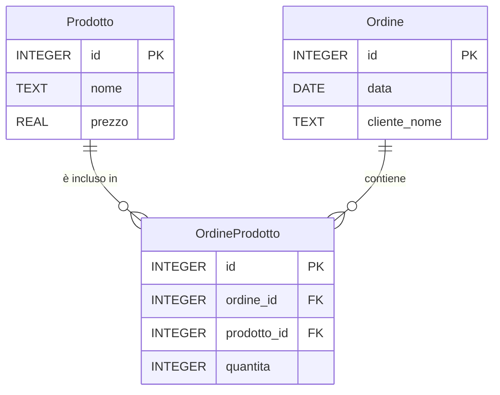

# Esercizio: gestione ordini semplice (testo)

**Nota:** questo esercizio richiede di tradurre il modello ER in tabelle SQL e di popolare il database con alcuni record di esempio. È sufficiente usare SQL standard (compatibile con SQLite).

Scenario
--------------------------------
Un piccolo negozio online tiene traccia degli ordini dei clienti. Per semplicità il dominio è ridotto: ci sono prodotti e ordini. I prodotti hanno un codice, un nome e un prezzo. Gli ordini registrano la data e il nome del cliente che li ha effettuati; ogni ordine può contenere più prodotti con quantità diverse.

Modello ER
----------------------------------

Compiti
-------
1. Partendo dal modello ER fornito, scrivi gli statement SQL `CREATE TABLE` per le tre tabelle principali: `Prodotto`, `Ordine` e la tabella di associazione `OrdineProdotto`.
2. Usa esattamente i valori di seguito per popolare le tabelle (in modo che i risultati degli studenti siano uniformi). Inserisci i record con `INSERT`.

     Valori da inserire:
     - Prodotti (5 record):
         - (1, 'Notebook', 12.5)
         - (2, 'Penna a sfera', 1.2)
         - (3, 'Zaino', 28.0)
         - (4, 'Agenda', 7.5)
         - (5, 'Quaderno', 5.0)

     - Ordini (3 record):
         - (1, '2025-10-01', 'Anna Verdi')
         - (2, '2025-10-02', 'Marco Neri')
         - (3, '2025-10-03', 'Anna Verdi')

     - OrdineProdotto (5 record):
         - (1, 1, 1, 2)
         - (2, 1, 2, 5)
         - (3, 2, 3, 1)
         - (4, 3, 4, 2)
         - (5, 3, 2, 3)
3. Fornisci le seguenti query di esempio (testo + SQL):
   - Elenco dei prodotti che costano meno di 10.
   - Elenco dei prodotti ordinati in un determinato ordine (id ordine come esempio).
   - Numero di ordini per ogni cliente.
   - Media dei prezzi dei prodotti.
   - Quantità totale venduta per ogni prodotto.
   - Elenco di tutti i prodotti con la quantità totale venduta (NULL per quelli mai venduti).
   - Prodotti con quantità totale venduta maggiore di 5.
   - Totale speso per ogni cliente.
-------
Carica un file `.sql` contenente i comandi `CREATE TABLE` e `INSERT` richiesti, più le query di esempio.
